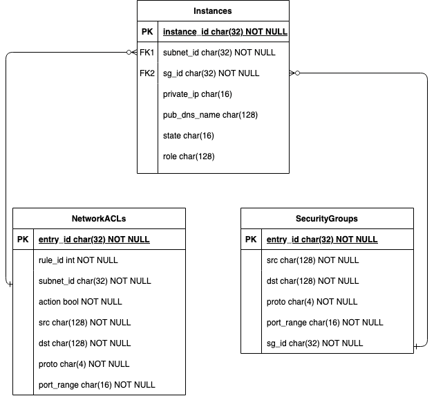
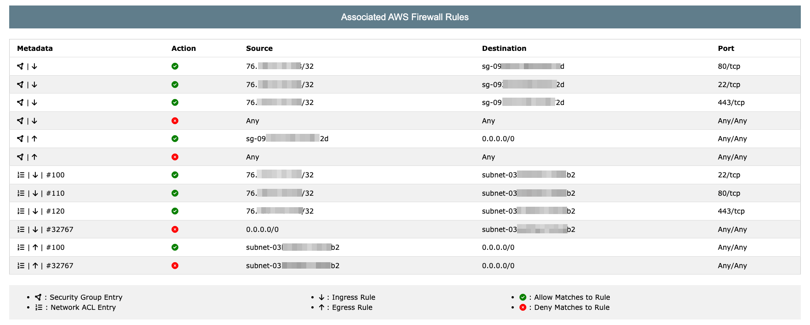

Elastic Cloud Segmentation Scraper
==================================

An Amazon Web Services (AWS) Elastic Cloud Compute (EC2) Network Access Control List (NACL) and Security Group (SG) configuration scraper. This project was completed in fulfillment of requirements for a Master's of Information Technology (MSIT) capstone project.

## Table of Contents

1. [Usage](#usage)
2. [Synopsis](#synopsis)
3. [Research Question](#research-question)
4. [Problem Statement](#problem-statement)
5. [Data Preparation](#data-preparation)
6. [Feature Engineering](#feature-engineering)
7. [Potential Next Steps](#potential-next-steps)
8. [Conclusion](#conclusion)

---

## Usage
This program is intended to be run through a command line interface (CLI) in two phases: ingestion and analysis. The ingestion phase consistis executing the configuration collector script, `collector.py`, while supplying valid AWS programmatic credentials. The collector script will scrape data from the AWS Application Programming Interfaces (APIs) and write information into a local Sqlite database. The user then executes the `server.py` script, which initiates a web application listening on the loopback interface on Transmission Control Protocol (TCP) port 8000. The user may then navigate to the web application in a browser to explore configuration scraping results.

~~~
user@ubuntu:~: python3 -m pip install -r requirements.txt

user@ubuntu:~: python3 collector.py --help
usage: python3 collector.py <args>

optional arguments:
  -h, --help                       show this help message and exit
  --access-key-id ACCESS_KEY_ID    AWS Access Key Id
  --secret-key SECRET_KEY          AWS Secret Access Key
  --session-token SESSION_TOKEN    AWS Role Session Token [optional]
  --region REGION                  Primary AWS Region [default: us-east-1]

user@ubuntu:~: python3 collector.py --access-key-id $AccessKey --secret-key $SecretKey --session-token $Token --region $Region
[+]  Successfully called 'Describe Instances'
[+]  Successfully called 'Describe Security Groups'
[+]  Successfully called 'Describe Network ACLs'

user@ubuntu:~: python3 server.py 
Bottle v0.12.21 server starting up (using WSGIRefServer())...
Listening on http://127.0.0.1:8000/
Hit Ctrl-C to quit.

~~~
> **Note:** The example above assumes the user has stored their AWS credentials and desired region to scrape within environment variables.

## Synopsis
This project leverages AWS APIs to identify AWS cloud-native firewall rules (i.e., Network ACLs and Security Groups) in place for EC2 instances. The tool consolidates these rulesets into a single view to help users identify segmentation gaps or unintended firewall access control patterns.

## Research Question
How can programmatic collection of AWS security group and network ACL configurations be leveraged to provide security assessors with insights into a cloud environment's segmentation controls?

## Problem Statement
The significant popularity of cloud platforms for business use that has developed over the past years has offered incredible advantages to customers in terms of security, availability, and performance. However, the transition to cloud-hosted environments is not a simple process in which companies can "lift and shift" their information technology (IT) infrastructure with complete ease. Proper care must be taken to ensure well-defined security controls and configurations prepared within on-premise environments are applied similarly in the cloud. One such security control used to protect critical IT infrastructure is the concept of network segmentation. Network segmentation is applied to control communications to high-value systems and applications by restricting connections to a minimal set of trusted and known hosts and services. An evaluation on the implementation of an organization's network segmentation is a common requirement to determine compliance with various regulations such as the Payment Card Industry Data Security Standard (PCI-DSS). These assessments can include multiple components including penetration testing, segmentation scanning, and firewall configuration reviews. Robust tools such as Titania Nipper exist to automate the evaluation of firewall configurations across many different network security appliances, however network migrations to cloud environments have introduced new ways of segmenting systems. Controls such as Security Groups (SGs) and Network Access Control Lists (NACLs) in Amazon Web Services (AWS) provide functionality similar to traditional firewalls. As such, the inclusion of SG and NACL configuration reviews can greatly bolster the depth and value provided by segmentation testing of AWS hosted environments.

## Data Preparation
Preparation of data for this project consisted of creating target EC2 instances for which configuration data could be scraped, configuring NACL and SG rulesets to have non-standard settings, and determing a database schema for storing the resulting data. The environment used for development and testing was created within a single Virtual Private Cloud (VPC) and single AWS region. AWS API documentation was then reviewed in order to determine what information could be programatically obtained. The database schema depicted below was designed in order to persistently store this information for later use by the web application server.

The database consists of three tables: Instances, NetworkACLs, and SecurityGroups. The Instances table is used to list EC2 instances configured within the supplied region during configuration scraping. This table also associates which NACL and SG is designated, and uses the `subnet_id` and `sg_id` values to create relationships to the NetworkACLs and SecurityGroups tables, respectively. Additional values including the configure private Internet Protocol (IP) address, instance state, and associated IAM role are stored as well for additional insights and future tool expansion. The NetworkACLs table stores rules associated with various AWS subnets. These rules are stateless, meaning entries must exist for both incoming (ingress) and outgoing (egress) traffic in order for connections to be accepted. The table stores the action, or whether the traffic should be allowed or denied, the rule id (i.e., order of rule evaluation), source, destination, and port values which collectively create a rule entry. The SecurityGroups table stores rules assoicated with various AWS security groups. Security Groups in AWS are stateful and 'allow-only'. This means that SG rules can only allow traffic (i.e., they cannot explicitly deny connections) and a rule created in either the ingress or egress connection will automatically allow the necessary connection in the opposite direction. This table stores the source, destination, and port which collectively make a security group rule entry.

## Feature Engineering
Features for this project were implemented in itterative development and testing cycles. Prior to the commencement of development, a list of requirements were created to guide feature implementation. The following items were determined to be the requirements that would be fulfilled prior to project completion:

1. The program must obtain lists of EC2 instances and their associated Security Groups and network subnet.
2. The rule entries for relevant security groups must be obtained.
3. The Network ACL entries for relevant network subnets bust be obtained.
4. Configuration information must be stored in a manner that establishes relationships between NACL and SG rules to EC2 instances.
5. The user must be able to view EC2 instances configured in the region and list which EC2 instances are associated to the identified seecurity groups and subnets.
6. The user must be able to view both NACL and SG rule entries for a given EC2 instance in a single, central view without jumping between multiple tabs.

These requirements were met through four application components: a configuration ingestor script (`collector.py`), a light-weight sqlite database (`ecsegscan.sqlite`), a back-end web server and REST API (`server.py`), and a dynamic single-page web application (`index.html`). 

The configuration ingestor and scraper is implemented in Python 3.9.10 and leverages the official AWS API library, `boto3`. The ingestor fulfils the first three requirements by iterating through the responses from the AWS EC2 API. First, the script performs a *Describe Instances* call which provides a list of EC2 instances within a given region along with various configuration details including the instance's security group and network subnet. The script stores this information and adds the security groups and network subnets to a list to be used for subsequent API calls. The script then iterates through the list of security groups, performing the *Describe Security Group* API call. This call returns metadata including the firewall rules associated with the given security group id. Next, the ingestor performs *Describe Network ACL* calls with the network subnets collected from the first API endpoint. Similarly to security group data collection, this API endpoint returns the network ACL rule entries associated with a provided subnet id. Finally, the script writes this information into the `ecsegscan.sqlite` database, which fulfills the fourth program requirement by establishing a relationship between SG and NACL rules to each EC2 instance id.

The back-end web server and REST API is also implemented in Python 3.9.10 with the support of the `bottle` Python library. This application component serves the front-end content and supports multiple API endpoints that allow the front-end to interface with the database. With these APIs, the back-end performs queries to the database and returns query responses as JavaSript Object Notation (JSON) data within the server's HTTP responses. By doing so, the back-end component fulfils project requirement four.

The front-end web application's dynamic functionality is powered by JavaScript, specifically jQuery version 3.1.0. The front-end is event-driven and API powered, meaning that dynamic functionality is executed in response to user interactions and primarily relies on client-side code to format data produced by server-side API responses. Four functions support the application's dynamic capabilties: `clearRows(table)`, `fillFirewallRulesTable(subnet, sg)`, `switchView(viewname)`, and `fillNaclSgTable(type, id)`. The `clearRows` function takes in a string indicating a table id within the page's document object model (DOM) and removes all rows from the table. This is a 'helper function' leveraged by the other functions to make the code more readable. The `fillFirewallRulesTable` is supplied with a subnet id and security group id that are used to perform API calls to the back-end and retrieve the rule entries from the database. Rule entries are then entered as table rows in the order of ingress SG entries, egress SG entries, ingress NACL entries, and finally egress NACL entries. This information is displayed in the middle of the three HTML tables and fulfills requirement five of the project. The `switchView` function changes the content of the top table to display either EC2 instance information, NACL information, or SG information depending on the name of the view supplied as a function argument. Finally, the `fillNaclSgTable` function is passed a *type* and *id* parameter. The *type* parameter indicates whether the *id* is a subnet id or security group id. The function then determines which EC2 instances are within the subnet or security group and displays these instances in the bottom table of the application, fulfilling the sixth and final project requirement. An example of what information the application can display is depicted below. Full values for security group, subnet, and IP addresses have been masked for privacy.

## Potential Next Steps
Following the completion of the project, ideas for future expansion and functionality have been identified for later implementation. Support for these items can provide additional insights into opportunities for an attacker to perform lateral movement and break network segmentation, or may increase the usability and user experience of the tool.

1. Support for output filtering may increase usability by making navigation of results more easy for end users.
2. Implementing a way to view EC2 instance Identity and Access Management (IAM) role associations as well as attached IAM policies for the role may be useful to see privileges an attacker could obtain through a compromise of an EC2 instance.
3. Desiging a way for the ingestor script to scrape multiple AWS regions or AWS accounts may allow users to more easily collect EC2 inventory and NACL / SG configurations for all instances within their environment(s) in a single use of the program.

These potential next steps were identified following the completion of the project and were not included within the original scope for project requirements.

## Conclusion
This project provides a proof of concept (PoC) as to how AWS APIs can be leveraged to programatically identify firewall rules associated with EC2 instances within a VPC. The project supports data collection by performing authenticated AWS API calls, formats API output into a relational database, and allows users to get a visual synthesis of security group and network ACL associated with EC2 instances within a single table. This project may enable auditors or security analysts to more easily identify segmentation gaps or configuration of overly permissive firewall rules within AWS VPCs. Implementation of additional features in the future could improve the tool's usability as well as provide support for identification of segmentation breaks through AWS IAM privileges granted to EC2 instances.